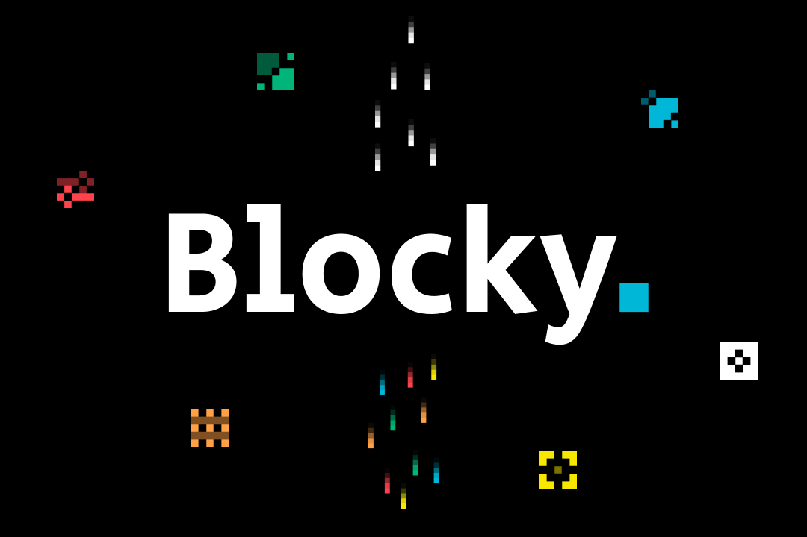
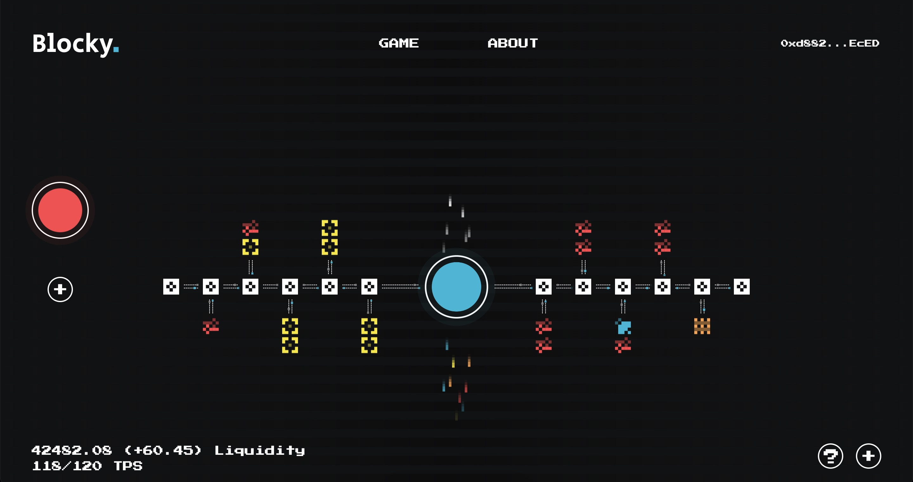
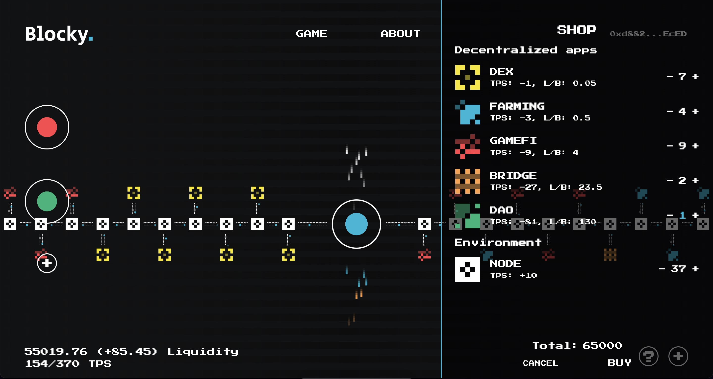
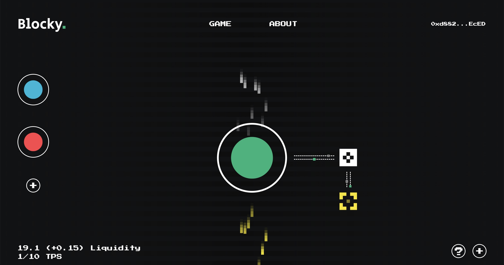
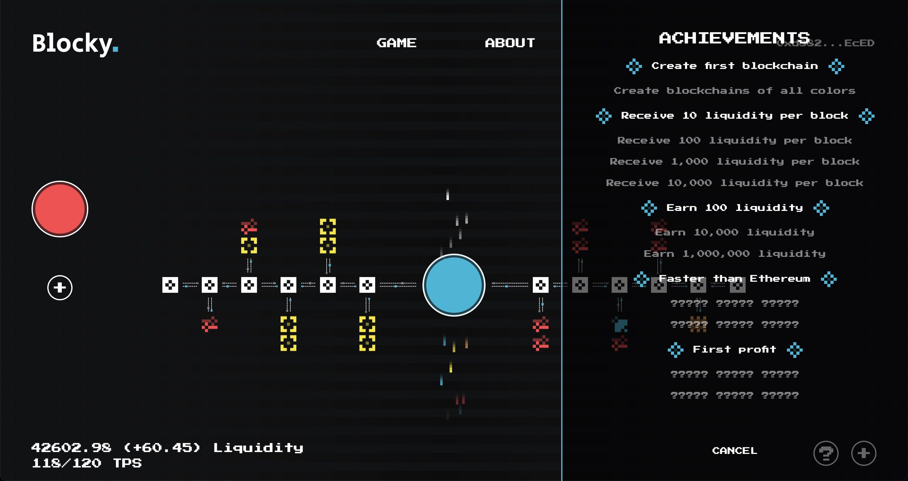

<p align="center">
  
</p>

# Blocky.

**Blocky.** is a on chain incremental game, the idea of which is to develop your blockchain by creating nodes, DEXes, bridges, and more.

```The game works on the Polygon Mumbai network.```

[Try to play!](https://pobepto.github.io/blocky/)
<br />
[Gameplay demo](https://vimeo.com/742018023)

*Developed as part of a hackathon [Polygon BUIDL IT : Summer 2022](https://buidlit.devpost.com/)*

## Inspiration
Today, most Web3 games are not only built on blockchain technology\contracts, but also use centralized servers. In turn, this violates the principles of decentralization.

## What it does
Thus, we wanted to create an interesting and exciting game that runs entirely on the blockchain. We chose Idle because we didn't find games of such type among web3 games and it was a challenge for us to adapt it for web3.

## Challenges we ran into
We found out about the hackathon quite late and decided to make it in 3 weeks before the deadline. It was difficult, but we managed to meet the deadline.

## Accomplishments that we're proud of
Within the hackathon we created the whole project from scratch, specifically the game design, the contracts and the web app. You can see all the code in our repository.

## What's next for Blocky.
Further we plan to continue to develop the game and deal with the balancing of the game mechanics.

In the future, new mechanics may be added that will make the game more interesting.

# Screenshots
<p align="center">Gameplay</p>

<br />
<p align="center">Shop</p>

<br />
<p align="center">New chain</p>

<br />
<p align="center">Achievements</p>

<br />
